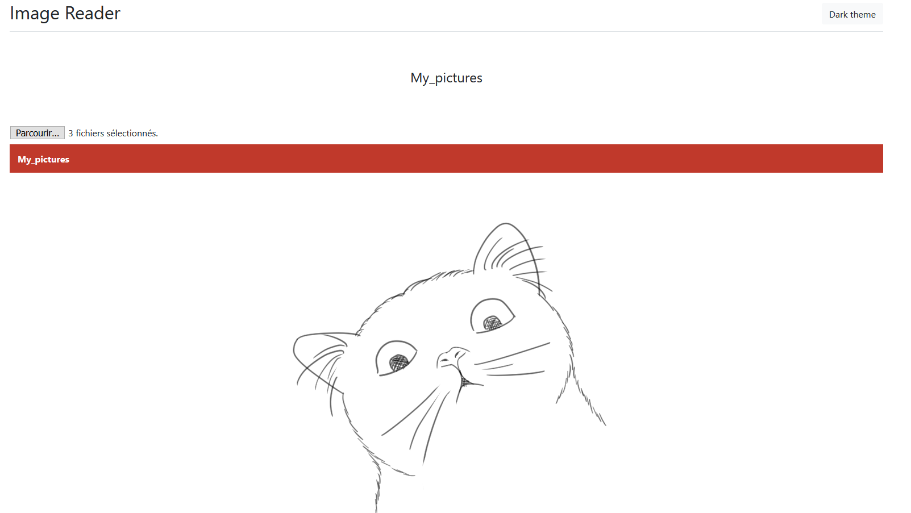
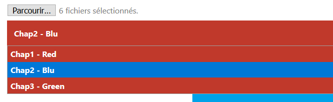
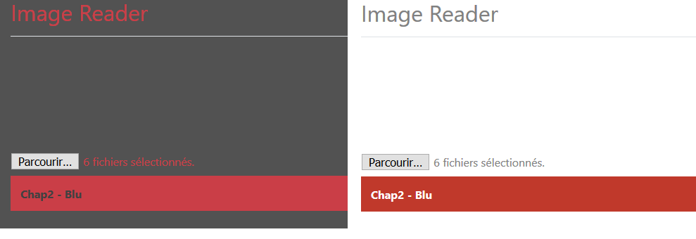

# ImageViewer
Read long string of picture, pure html/javascript/css (no nodejs, no server required, no installation required). Useful for reading manga as an example.

## **Requirements**
**No** Requirement/dependency needed.

**No** Installation required.

## **How to use it**
2 possibility : 

- Copy the files inside the folder "source_files" and put them next to your repository with the pictures.

- Copy the file ["ImageViewer_onefile.html"](https://github.com/0pb/ImageViewer/raw/master/ImageViewer_onefile.html) next to a folder containing picture and it's done ! Just click on the html file, then on "browse" and then the folder containing the picture.


Place the file like so : 


```bash
#   Valid : 
    repository/
        ├── folder_selected_by_user/
        └── ImageViewer_onefile.html
#	OR 
    repository/
        ├── ImageViewer.html
        │   ..
        ├── ImageViewer.js
        └── folder_selected_by_user/

```


## **Features**

- Can search trought multiples folders.

- Light and dark theme.

- Quick (33ms to load an page with 100 pictures)

- Picture size depend on window size.

- Automatically sort picture by name, you don't need to do it yourself.

- Every file is one under another for a great reading experience.


## **Specification & why**
Doesn't require a beefy pc, as it actually doesn't load the picture in your browser, only the path.

I have yet to see any offline manga reader/image viewer that is small and doesn't need installation with numpy. Therefore I made my own.

---

## Exemple

### Example 1 (single folder) : 
```bash
    repository/
        ├── ImageViewer_onefile.html
        └── My pictures/
        		├── 1.png
        		├── 2.png
        		└── 3.png
```

Result

---

### Example 2 (multiples folders) : 

```bash
    repository/
        ├── ImageViewer_onefile.html
        └── Multiples_folders/
        		├── Chap1 - Red
	        	│	├── red.png
	        	│	└── red2.png
        		├── Chap2 - Blu
	        	│	├── blu_a.png
	        	│	└── blu_b.png
        		└── Chap3 - Green
	        		├── green_001.png
	        		└── green_002.png
```

Result

---

### How the picture are displayed one after another : 


---

### Light theme / dark theme : 


## Issues & Future 

- Work on latest Firefox, didn't test on chrome, opera or IE.

- Cannot read huge folder (~ 5000+ sub-folders 150k pictures inside), under 3000 sub-folders should be fine.

- Cannot read folder one level down or one level above.


