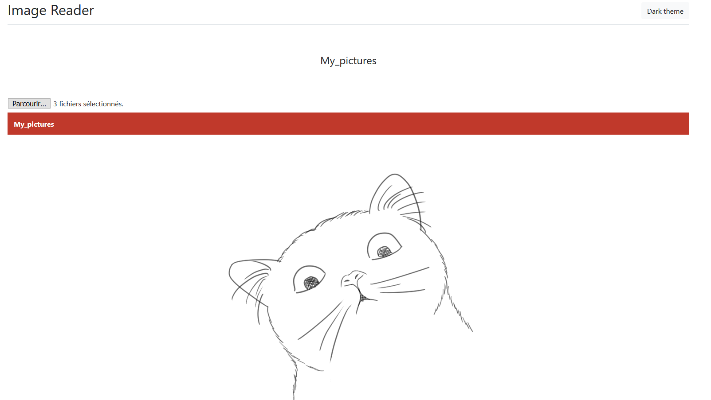
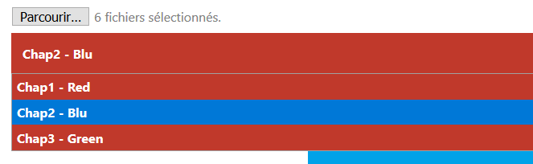
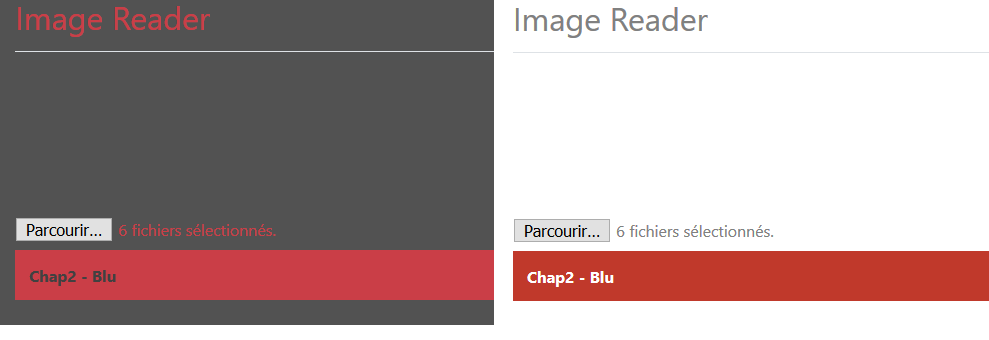

# ImageViewer
Read long string of picture, pure html/javascript/css (no nodejs, no server required, no installation required)


## **Requirements**
**No** Requirement/dependency needed
**No** Installation required

## **How to use it**
2 possibility : 

- Copy the 5 files : "jquery-latest.min.js", "bootstrap.min.css", "ImageViewer.css", "ImageViewer.js" and "ImageViewer.html" inside a folder next to another folder containing picture and it's done ! Just click on the html file, then on "browse" and then the folder containing the picture.

- Copy the file "ImageViewer_onefile.html" next to a folder containing picture and it's done ! Just click on the html file, then on "browse" and then the folder containing the picture.

Where you can place the file : 

```bash

#   Valid : 
    repository/
        ├── ImageViewer.html
        │   ..
        ├── ImageViewer.js
        └── folder_selected_by_user/
#	OR 
    repository/
        ├── folder_selected_by_user/
        └── ImageViewer_onefile.html

#   ----------------------------------------
#   NOT Valid : 
    repository/
        ├── ImageViewer.html
        │   ..
        ├── ImageViewer.js
        └── folder_selected_by_user/
                └── folder_selected_by_user/
    
#   NOT valid : 
    repository/
        ├── folder_selected_by_user/
        └── folder/
                ├── ImageViewer.html
                │   ..
                └── ImageViewer.js

#   NOT valid : 
    repository/
        ├── folder/
        │       └──folder_selected_by_user/
        └── folder/
                ├── ImageViewer.html
                │   ..
                └── ImageViewer.js
```

## **Features**
- Can search trought multiple folder
- Light and dark theme
- Quick (33ms to load an page with picture)
- Reactive (picture size depend on window size)
- Sort picture on name
- No Pagination (every file is one after another)

## **Specification & why**
Doesn't require a beefy pc, as it actually doesn't load the picture in your browser, only the path.

I have yet to see any offline manga reader/image viewer that is small and doesn't need installation with numpy. Therefore I made my own.

---

## Exemple

### Example 1 (single folder) : 
```bash
    repository/
        ├── ImageViewer_onefile.html
        └── My pictures/
        		├── 1.png
        		├── 2.png
        		└── 3.png
```

Result

### Example 2 (multiples folders) : 

```bash
    repository/
        ├── ImageViewer_onefile.html
        └── Multiples_folders/
        		├── Chap1 - Red
	        	│	├── red.png
	        	│	└── red2.png
        		├── Chap2 - Blu
	        	│	├── blu_a.png
	        	│	└── blu_b.png
        		└── Chap3 - Green
	        		├── green_001.png
	        		└── green_002.png
```

Result

### How the picture are displayed one after another : 


### Light theme / dark theme : 


## Issues & Future 

- Work on latest Firefox, didn't test on chrome, opera or IE.

- Cannot read huge folder (~ 5000+ sub-folders 150k pictures inside), under 3000 sub-folders should be fine.

- Cannot read folder one level down or one level above.


